# Presentación Final SO
## Docente: Ing. Jorge Romo   Miguel Ruiz 13824   Elias Neder 13897

# ¿Qué hace un sistema Operativo?
Es un programa que se utiliza para comunicarse y poder trabajar con  los elementos de una computadora.  
Actualmente es una necesidad debido a la complejidad del hardware y las aplicaciones.

## Un sistema operativo se encarga de
1. Ejecución de programas
2. Operaciones de entrada y salida
3. Manipulación de Archivos y directorios
4. Comunicación entre procesos
5. Comunicación entre diversos dispositivos
6. Administración de protección y seguridad
7. Leer el estado del sistema (Task manager en Windows)

# Manipulación de archivos y directorios
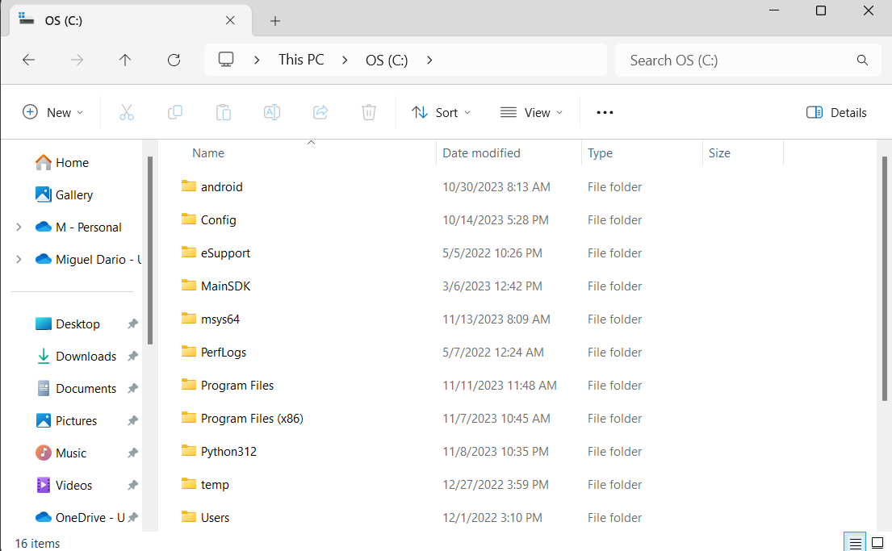
Contamos con la capacidad de identificar los archivos y directorios, observando propiedades, ubicación, permisos, nombre.   
Podemos crear, eliminar, modificar, cambiar ubicacion de archivos y directorios. 

## Git 

Contamos con herramientas como lo es Git, la cual es un manejador de versiones. Un manejador de versiones nos permite gestionar los cambios que se le hacen a algun producto.   
Fue creada por Linus Torvalds y el equipo de desarrollo de Linux y lanzada en el año 2005.  
Esta nace a raíz de la falta de manejadores de versiones gratuitos y de open source. 

# Open Source
El open source es software cuyo dueño decide publicar con el fin de que cualquiera pueda utilizarlo, distribuirlo o modificarlo.   
Entre los productos de open source destaca el sistema operativo Linux, en el cual existen miles de distribuciones ya que al tratarse de un software de open source cualquiera puede acceder a su codigo base y trabajar sobre él.  

# Historia de macOS
## Primera version
Comienza en 1984, integrando una Interfaz Gráfica de Usuario, comenzando con esta era en las computadoras. 
A diferencia de las demás computadoras de su época, en la Macintosh se podia utilizar un mouse para navegar en el finder, un sistema con folders y archivos virtuales, esto en lugar de utilizar comandos de texto.  

## Integracion de NeXT 1999
En 1996 Apple adquiere NeXT, compañia fundada por Steve Jobs. Con esta adquisición Apple es capaz de lanzar en el año 2001 Mac OS X. Este sistema operativo corre en una base de UNIX, por lo que comparte similitudes con el sistema Linux. 

### Mac OS X 10.0 (Cheetah) Marzo 2001

Utiliza una interfaz llamada Aqua y adopta el sistema de NeXTSTEP. Es un sistema operativo orientado a objetos. Al estar basado en UNIX se convierte en un sistema operativo más estable.
### Mac OS X 10.1 (Puma) Septiembre 2001
Trae consigo cambios en el rendimiento, permitía reproducir DVD, incluía más drivers para impresoras, ImageCapture para obtener imagenes de cámaras digitales, se introduce AppleScript Studio.
### Mac OS X 10.2 (Jaguar) Agosto 2002
Se incluye soporte para archivos escritos en MPEG-4, Incluye una lista de direcciones, además de incluir Rendezvous, que era un sistema que permitía descubrir dispositivos en la misma red, ofreciendo la capacidad de compartir sus servicios.
### Mac OS X 10.3 (Panther) Octubre 2003
Introduce a Safari como el navegador predeterminado. Permite la concurrencia de usuarios activos. Xcode.
 

 

### Mac OS X 10.4 (Tiger) Abril 2005
Spotlight, permite buscar en todos los documentos de una Mac. iChat AV permite tener hasta 4 personas en video llamada y 10 personas en audio. Xcode 2.0

### Mac OS X 10.5 (Leopard) Octubre 2007

  

Cambios a la interfaz de usuario. Back to My Mac. Boot Camp, permitía accesar documentos en tu computadora desde fuera usando internet. iCal. 

### Mac OS X 10.6 (Snow Leopard) Agosto 2009
Integro la Mac App Store. Más ligero en almacenamiento. Soporte para Microsoft Exchange.

### Mac OS X 10.7 (Lion) Julio 2011

  

AirDrop utilizando Wi-Fi Direct. Autocorrector. Push Notifications. Soporte para el uso de Emoji. QuickTime incorpora utilidades de la version pro. 

### Mac OS X 10.8 (Mountain Lion) Julio 2012

  

Notification Center. Notas. Mensajeria propia. Game Center. AirPlay Mirroring. 

### Mac OS 10.9 (Mavericks) Octubre 2013
Se incluye aplicacion de iBooks para comprar y leer libros en la computadora. Maps, al igual que en iOS es utilizada para buscar direcciones y obtener rutas. En FaceTime ya no se necesita usar la camara. Opcion para bloquear en iMessage.

### Mac OS 10.10 (Yosemite) Octubre 2014

  

Handoff, permite hacer llamadas y mandar mensajes por medio de la Mac utilizando el iPhone; también permite continuar el trabajo comenzado en una app del celular en su equivalente en la computadora, por ejemplo un correo. Photos reemplaza iPhotos y Aperture.

### Mac OS X 10.11 (El Capitan) Septiembre 2015

  

Permite utilizar la función de split screen, teniendo una aplicación de cada lado de la pantalla. Su aplicación de mapas muestra tráfico en tiempo real. Las notas se sincronizan con iCloud. 

### Mac OS 10.12 (Sierra) Septiembre 2016

Permite acceder a Siri. Detalla el uso de almacenamiento por aplicación, además de permitir un respaldo automatico de documentos y directorios a iCloud. Auto Unlock con iWatch. Se introduce el Apple File System, dejando atras el HFS Plus; esta hecho para SSD y Flash Memory. Introduce el modo nocturno. Se ntroduce Apple Pay, permitiendo el pago con un iPhone o con el iWatch. Ahora se puede colaborar en notas con otras personas.

### Mac OS 10.13 (High Sierra) Septiembre 2017

  

APFS se covierte en el sistema de archivos por defecto. 

### Mac OS 10.14 (Mojave) Septiembre 2018

Se retira integración con Facebook, Twitter, Vimeo y Flickr. Se agrega el group FaceTime, en el que se puede hacer video llamada con hasta 32 personas. Cambios realizados a la Mac App Store para que sea parecida a la de iOS. Se agregan apps de iOS como stocks, home, news.

### Mac OS 10.15 (Catalina) Octubre 2019

  
No soporta apps con arquitectura de 32 bits. Se presenta Catalyst, una herramienta para desarrollo de software que permite hacer aplicaciones nativas para macOS, iOS y iPadOS. Cambios en la seguridad del equipo. Sidecar, permite utilizar una iPad como segunda pantalla de la Mac. Se reemplaza iTunes por las apps de Music, Podcasts, TV y Books.Se juntan Find My Mac y Find My Friends para crear Find My, el servicio utilizado para encontrar dispositivos de la familia de Apple.

### Mac OS 11 (Big Sur) Noviembre 2020

  
Se incluye el centro de control similar al disponible desde iOS 7. Se incluye soporte para los nuevos chips de apple, los Apple Silicon, comenzando con el M1. A partir de Big Sur se pueden utilizar apps de iOS y de iPadOS de forma nativa. Integra la encriptación a nivel de archivos, anteriormente solo se podian encriptar volumenes enteros.

### Mac OS 12 (Monterrey) Octubre 2021

  

Se introduce TestFlight para Mac, lo que permite probar aplicaciones mobiles. Se introduce Shortcuts para Mac, permitiendo así crear macros para correr procesos específicos en el dispositivo, además de compartirlos. Cambios en FaceTime como modo retrato o cancelación de ruido, también la opción de compartir pantalla. Se agregan bases para utilizar el control universal, lo que permite utilizar los mismos dispositivos como mouse y teclado a traves de diversos dispositivos como iPad y Mac. Medidas de privacidad como focus para manejo de notificaciones, aviso de uso de cámara o microfono. Soporte para AirPlay desde otros dispositivos hacia la Mac. 

### Mac OS 13 (Ventura) Octubre 2022

  

Se agregan apps de clima y reloj de iPad y iOS. Freeform, una app que sirve de pizarron virtual en el que pueden colaborar varias personas de forma simultanea. Se agrega la habilidad de cambiar entre dispositivos en una llamada de FaceTime. Edición en mensajes permitida.

### Mac OS 14 (Sonoma) Septiembre 2023

Widgets utilizables en toda la pantalla. Pantalla de bloqueo similar a la de iOS y iPadOS, con reloj y fecha. Se podrán portar juegos de Windows a macOS. 

# Historia de Ubuntu
## Debian 
Su historia comienza en 1993 de la mano de Ian Murdock, y su primera distribución estable fue publicada en Junio de 1996.
## Ubuntu
Comienza cuando Mark Shuttleworth junta a un grupo de desarrolladores de Debian con el propósito de crear una distribución de Linux que fuera fácil de utilizar. Ubuntu publica nuevas versiones cada 6 meses aproximadamente, las cuales reciben soporte por los siguientes 9 meses, en un inicio eran 18. Actualmente se cuenta con versiones LTS (Long term support), que son versiones publicadas cada 4 lanzamientos, estas cuentan con soporte gratuito por los siguientes 5 años a su publicación. 
## Primera Version
### Ubuntu 4.10 (Warthy Warthog) 
Publicada el 20 de octubre de 2004. Permitía a los usuarios ordenar CDs gratis en donde venía el sistema para su instalación. Contaba con programas como OpenOffice.org 1.1.8, Mozilla Firefox 0.9, etc. En la versión de servidor se incluía MySQL 4.0, Python 2.3, etc.
 

  

## Versiones LTS
### Ubuntu 6.06 (Dapper Drake)
Presentada el 1 de Junio de 2006. Con soporte por 3 años en su version de escritorio y 5 en servidor. Se instalaba con CD. Proceso de apagado gráfico. NetworkManager para cambiar entre redes alámbricas e inalámbricas. Acomodo del system path.

### Ubuntu 8.08 (Hardy Heron)
Instalación más pesada, requería de 348 MB de memoria para la instalación por CD. Por su tamaño partes del programa de OpenOffice.org y de la instalación de Java no venían en el CD. Permitía actualizar versiones anteriores de forma sencilla.

### Ubuntu 10.04 (Lucid Lynx)

# Comandos de la terminal de Unix

- cd: Cambiar de directorio
- mkdir: Crear directorio
- touch [nombre.tipo_de_archivo]: Crear archivo
- cp [nombre del archivo]: Copiar archivo
- cp -r: Copia los archivos de un directorio
- pwd: Dice el nombre del Path Working Directory 
- history: Muestra el historial de comandos
- ls: Muestra los archivos dentro de un directorio
- ls -la: Agrega informacion extra y archivos ocultos
- vim fileName: Abre el archivo con el editor de texto vim
- rm fileName: Elimina un archivo con el nombre indicado
- rm -r: Borra el directorio

## Comandos git
- git init: Inicia repositorio de git
- git add . : Agrega todos los cambios
- git add fileName: Agrega cambios al documento
- git commit -m: Guarda el cambio del repositorio listo para subir
- git push: Envia nuestros cambios

# Historia de Windows
La historia de Windows es bastante extensa y se remonta a finales de la década de 1970 cuando Microsoft fue fundada por Bill Gates y Paul Allen. Aunque la versión inicial de Windows se lanzó en 1985, su historia se puede dividir en varias etapas clave:

## MS-DOS y Windows 1.0
Microsoft inicialmente desarrolló MS-DOS, un sistema operativo basado en texto para las primeras computadoras personales. En 1985, lanzaron Windows 1.0, que ofrecía una interfaz gráfica limitada con ventanas superpuestas y menús desplegables.

    
    

## Windows 3.0 y 3.1
En 1990, Microsoft lanzó Windows 3.0, que fue un gran avance. Introdujo mejoras significativas en la interfaz gráfica y la multitarea. La versión 3.1, lanzada en 1992, mejoró la estabilidad y rendimiento.

    

## windows 95
Fue un hito importante en la historia de Windows, lanzado en 1995. Introdujo el famoso botón de "Inicio", el escritorio con íconos, el menú de inicio y una mayor facilidad de uso. Además, fue el primer Windows que tuvo un éxito masivo.

    

## Windows NT Server
Se trata de un sistema operativo para servidores que vio la luz por primera vez en julio de 1993. Su principal característica radica en su capacidad de expansión y su independencia de la plataforma y hardware. Compatible con procesadores Intel x86, RISC y DEC Alpha, permitía a los usuarios seleccionar sus sistemas informáticos. Destacado por su enfoque en estaciones de trabajo y servidores de red.

    

## Windows 98
Antes de Windows 98, se sucedieron distintas versiones del Windows 95 llamadas NT, diseñadas específicamente para entornos empresariales e industriales. Tres años después, el 25 de junio de 1998, Microsoft lanzó una nueva edición de su sistema operativo: Windows 98. Al igual que su predecesor, el nombre derivaba del año de lanzamiento y esta versión presentaba el sistema de archivos FAT32, enfocado en mejorar el acceso a la red. Además, introdujo la compatibilidad con lectores de DVD y la incorporación de los primeros puertos USB.

    

## Windows 2000
El 29 de marzo de 1999, se lanzó el sistema operativo NT 5.0 EUR Edition, que básicamente era la versión alemana del Windows NET 5.0 y más tarde fue renombrado como Windows 2000. Este sistema fue parte de la línea profesional de Microsoft, orientado a proporcionar un rendimiento óptimo para usuarios avanzados y profesionales que utilizaban programas de alto rendimiento. Parte del código fuente de esta versión se filtró en Internet, lo que llevó a la compañía a emplear su núcleo para desarrollar la nueva versión del sistema operativo.

    

## Windows Me 
Windows Millennium, lanzado por Microsoft el 14 de septiembre de 2000, fue una versión del sistema operativo en formato gráfico híbrido de 16/32 bits. Este sistema fue específicamente diseñado para los usuarios de PC. A pesar de seguir a versiones maduras como Windows 95 y Windows 98, no logró la aceptación esperada debido a sus continuos errores, como los conocidos pantallazos azules, y las desventajas en su uso.

    

## Windows XP
Lanzado en 2001, XP fue muy popular por su estabilidad y facilidad de uso. Fue una versión significativa que introdujo una interfaz más moderna y mejoró la seguridad.
    

## Windows Vista y 7
Vista, lanzado en 2007, tuvo una recepción mixta debido a problemas de rendimiento y compatibilidad. Windows 7, lanzado en 2009, corrigió muchos de estos problemas y se convirtió en una de las versiones más queridas.

    

    

## Windows 8 y 8.1
Estos sistemas operativos, lanzados en 2012 y 2013 respectivamente, presentaron una interfaz radicalmente diferente, con un énfasis en pantallas táctiles. Sin embargo, la recepción fue mixta debido a la curva de aprendizaje y la ausencia del botón de inicio.

    

## Windows 10
En julio de 2015, Microsoft lanzó Windows 10, su versión más reciente antes de Windows 11 en 2021. Esta versión destacó por su amplia gama de aplicaciones, una interfaz moderna y eficiente, y su capacidad multiplataforma, adaptable a computadoras y dispositivos móviles.

Windows 10 introdujo novedades como aplicaciones universales, el navegador Edge, el asistente Cortana, una nueva página de configuración, la función TimeLine y el regreso del deseado menú de inicio. Muchos consideraron esta versión como la mejor en la historia del sistema operativo, adaptada a las necesidades actuales de los usuarios.

    

## Windows 11

La versión más reciente del conocido sistema operativo es Windows 11, sucesor de Windows 10. Lanzado el 5 de octubre de 2021, ofrece un nuevo diseño visual, mejoras en rendimiento y una experiencia de uso más intuitiva

    

# Dispositivos de Entrada y Salida
## Entrada
Son los encargados de introducir datos en la memoria de la computadora. Se transforma la información de entrada en señales eléctricas. Ej. Teclado, mouse, cámara, micrófono.  

  

  

## Salida
Son los que ayudan a presentar la información del sistema al usuario de forma que se comprenda, puede ser por medio de imagenes, texto, sonidos, estímulos, etc. Estos dispositivos obtienen información de la memoria central y la exteriorizan. Ej. Bocinas, monitor, impresora.  

  

  

## Mixtos
Son dispositivos que permiten tanto la entrada como la salidad de información de la memoria central. Ej. Impresora con escaner, dispositivos con pantalla tactil.  

  

# Procesos
Es el nombre que se le da a la ejecución de un programa individual, el cual cuenta con una serie de instrucciones que el procesador debe ejecutar. Un proceso puede ser un programa en ejecución, una instancia de un programa ejecutado y una entidad que se puede asignar y ejecutar en el procesador. 

## Caracteristicas de los procesos
- Identificador: Cada proceso tiene un ID único que lo diferencía de los demás.
- Estado: Se refiere a si esta en ejecución, terminado, etc.
- Prioridad: Es el nivel de prioridad relativo a los demás procesos.
- Contador de programa: Incluye la dirección de la siguiente instrucción por ejecutar.
- Punteros de memoria: Punteros al código de memoria, los datos del proceso, además de bloques compartidos con otros procesos.
- Datos de contexto: Datos en el procesador mientras el proceso está en ejecución.
- Información de Estado E/S: Peticiones de E/S pendientes, dispositivos asignados, lista de ficheros usados por los procesos.
- Información de auditoría: Regristros del sistema, tiempo de ejecución, registros.

## Estado del Proceso
### Un proceso puede tener varios estados dependiendo de su ejecución
- Nuevo: Se Solicita la creación de un proceso
- Listo: Sistema listo para iniciar un proceso
- En ejecución: Proceso siendo ejecutado.
- Bloqueado: Proceso detenido por algún evento, necesita retirarse el bloqueo para continuar su ejecución.
- Zombie: Proceso finalizado, pero el sistema esta realizando acciones de limpieza para retirarlo de la lista de ejecución. 
- Terminado: El proceso terminó su ejecución. 

# Algoritmos de planeacion
1. First Come First Served(FCFS): 
Es un algoritmo que utiliza una fila de procesos determinando el funcionamiento de cada proceso en el orden de llegada.
La ejecicion del proceso no es interrumpida por otra llegada, este se ejecuta hasta terminarse. 
Ejemplo:
 

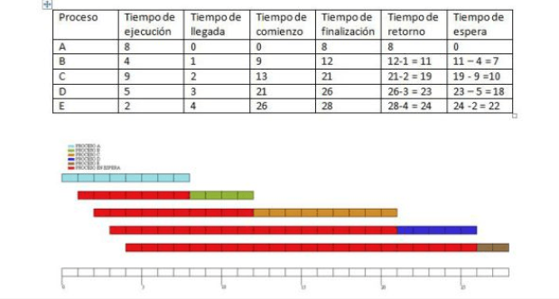
 

2. Shortest job first(SJF): 
Es un proceso el cual puede cambiar voluntariamente de estado dependiendo de los nuevos requests que se hagan, convirtiendolo en un proceso el cual no el tiempo de ejecucion no es determinado, cambiando entre procesos prioretizando a los que tengan un tiempo mas corto de completacion. si dos o mas procesos cuentan con el mismo tiempo de completacion se utiliza un algoritmo de FCFS.
 Ejemplo:

 

3. Planificador por turno rotatorio(Round Robin):
 
Es un algoritmo donde se determina el mismo tiempo para la ejecucion de todos los procesos. Si un proceso no puede ejecutarse por completo en el tiempo asignado su ejecucion sera despues de la ejecucion de todos los procesos que se ejecuten con el tiempo asignado. Este proceso esta fundamentado por FCFS y ordena la cola de procesos circularmente cuando se hallan en estados listos.
 
Ejemplo:
 

 
4. Planificacion por prioridad: 
Esta planificación se caracteriza porque a cada proceso se le asigna una prioridad y se continúan con un criterio determinado. Los procesos serán atendidos de acuerdo con la prioridad determinada. 
Ejemplo:
 

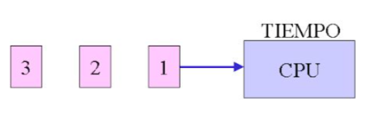
 

5. Planificacion garantizada: 
En este algoritmo el sistema se enfoca en la cantidad de usuarios que se debe de atenter dando las particiones reales en base a la cantidad de usuarios.

6. Planificacion de colas multiples: 
El algoritmo derivado del MQS (Multilevel Queue Scheduling) fragmenta la cola de procesos en estado de listos en múltiples colas más pequeñas. Los procesos se distribuyen en estas colas según un criterio específico que define en cuál de ellas serán ubicados cuando estén listos para ejecutarse
  Ejemplo: 

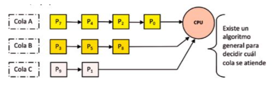 

# Almacenamiento
El almacenamiento de un sistema es la capacidad del mismo para grabar y conservar los datos en algun dispositivo de almacenamiento

## Unidades de almacenamiento
Existe una amplia variedad de dispositivos de almacenamiento los cuales cumplen con la funcion de grabar y almacenar los datos de un sistema, cada uno con su propia capacidad de almacenamiento y funcionamiento distinguiendolos unos de los otros. 
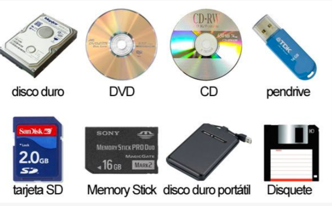 
El factor comun que tienen todos ellos es que utilizan alguna unidad de capacidad, desde las mas pequeñas hasta las mas grandes.

Estas unidades son las siguientes:
1. El bit siendo la mas pequena representada por la letra b representa la presencia de 0 o 1 indicando si hay o no corriente
2. El byte(B) siendo la primera unidad con sentido, conformada por 8 bits y leyendose como un caracter aproximadamente
3. El Kilobyte(KB) que es equivalente a 1024 Bytes.
4. Megabyte(MB) equivalente a 1024 KB.
5. Gigabyte(GB) equivalente a 1024 MB.
6. Terabyte(TB) equivalente a 1024 GB.
Tambien es comun que muchos sistemas operativos simplifiquen haciendo las operaciones por 1000 en vez de 1024
 

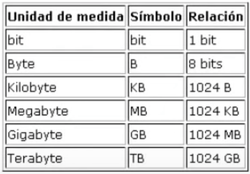 

# Jerarquia de memoria
Existen varios tipos de memorias en un sistema las cuales cumplen funciones distintas, es por esto que existe una jerarquia dentro de las mismas priorizando a ciertos tipos para que se cumplan sus funciones primero. 
## Tipos de memoria en la jerarquia
1. SRAM(Static Random Access Memory): es una memoria volatil, lo cual significa que los datos se pierden una vez que se apague el dispositivo. es usada para la implementacion del cache(memoria que guarda datos para su posible uso futuro).
2. SDRAM(Synchronous dynamic random access memory):su funcion es la implementacion de la memoria principal(RAM o similares).
3. Almacenamiento secundario local (discos duros o similares)
4. Almacenamiento secundario remoto (servidores,la nube etc.)
 

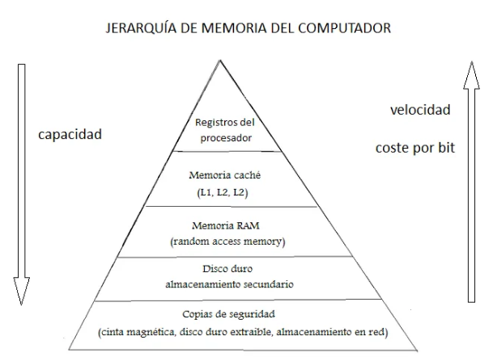  
## Patrones de acceso a memoria de los programas
Localidad temporal:
Es donde los datos se agrupan cuando hay una posiblidad de acceso futuro cercano. 

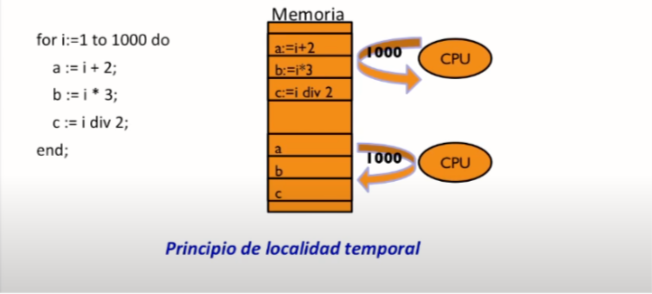  

Localidad espacial: lleva datos contiguos a los niveles proximos del procesador a su vez que son datos con una alta probabilidad de que accedan a otros datos o procesos cercanos. 

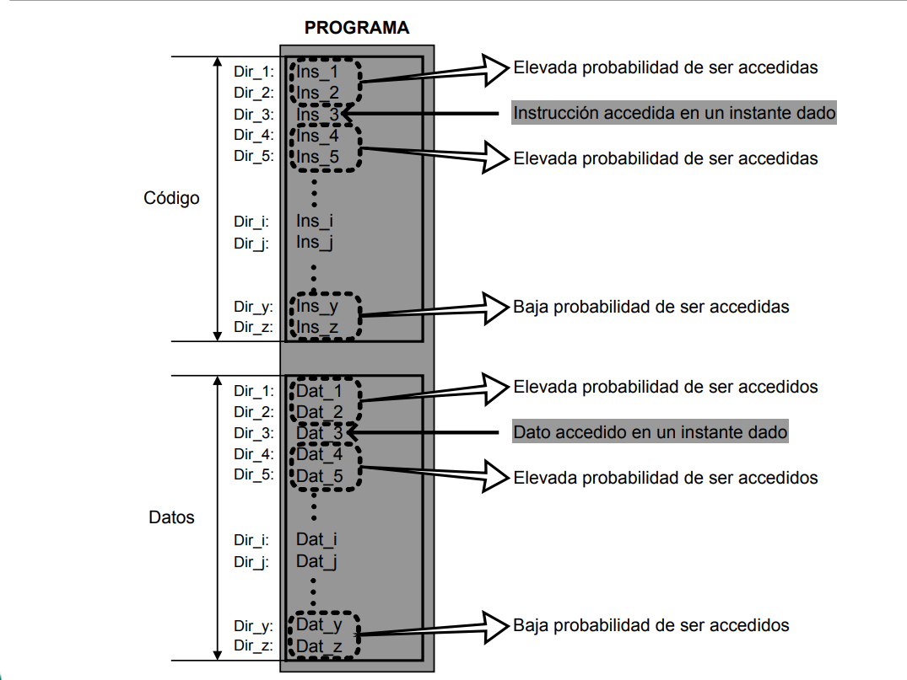  

Bloques: Es una unidad minima de intercambio de informacion entre el cache y la memoria principal, utilizando este metodo se reduce los tiempos de acceso a los datos haciendolo mas rapida. 

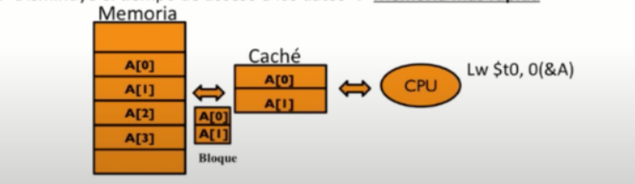 

# Virtualizacion de CPU
La virtualizacion de CPU es referente a una la tecnologia que permite ejecutar varias maquinas virtuales con distintos sistemas operativos dentro de la misma maquina fisica para cumplir con metas distintas segun las necesidades del usuario. El ejemplo mas comun son las virtual machines.  

  

# Virtualizacion de memoria
La virtualización de memoria es cuando se combinan los recursos individuales de memoria RAM de una red en un único grupo de memoria. Este proceso amplía la capacidad de memoria y permite que la unidad de disco funcione como una extensión de la memoria principal. 
EjemploÑ   

  

# Concurrencia
La concurrencia se refiere a la habilidad de ejecutar múltiples procesos o hilos de ejecución simultáneamente. Esta capacidad permite una ejecución eficiente y efectiva de diversas tareas, de esta manera optimizando la utilización de recursos.
 Ejemplo: 

  

# Persistencia
se refiere a la capacidad de conservar y mantener el estado o los datos de una aplicación o sistema a lo largo del tiempo. los ejemplos mas comunes serian las bases de datos almacenando grandes cantidades de datos o las cookies en los navegadores para guardar informacion sobre la navegacion.  
  

# Personajes historicos para los sistemas operativos
## Denis Ritchie

Dennis Ritchie, en colaboración con Kenneth Thompson, desarrolló Unix, un sistema operativo que no estaba limitado a hardware específico. Basándose en el lenguaje B de Thompson, Ritchie creó el lenguaje de programación C, el cual fue fundamental para reescribir el sistema Unix en este nuevo lenguaje. Su trabajo revolucionario no solo consistió en la creación de un sistema operativo versátil, sino también en la construcción de un lenguaje de programación poderoso y portable que ha influido significativamente en el desarrollo de software hasta la actualidad. Este enfoque en la portabilidad y la flexibilidad ha sido fundamental para la expansión y la adopción generalizada de Unix y C.  

  

## Linus Torvald
Es un científico computacional que, en 1991, desarrolló el sistema operativo Linux basándose en Unix debido a su insatisfacción con el sistema de su PC. Decidió inicialmente compartir el código fuente de este sistema operativo en internet, lo que permitió a otros contribuir al proyecto. En 1994, se lanzó la versión 1.0 de Linux. A raíz de este éxito, él y otros programadores idearon git, una herramienta para el manejo de versiones de su sistema de manera online  
  

## Bill Gates
Bill Gates cofundó Microsoft en 1975 y su enfoque inicial fue el desarrollo de software. En los años 80, con el acuerdo con IBM, adaptaron un sistema operativo existente para convertirlo en MS-DOS, el cual se convirtió en un estándar para las computadoras personales. El gran salto llegó con Windows en 1985, que introdujo una interfaz gráfica de usuario, facilitando el uso de las computadoras para todos. Esta visión de sistemas operativos más accesibles y amigables con el usuario llevó a Windows a ser líder en la industria de las PCs y dejó una marca duradera en la informática moderna.

    

## Steve Jobs

Steve Jobs lidero el desarrollo de macOS para computadoras y iOS para dispositivos móviles. Con la Macintosh, presentó una interfaz gráfica revolucionaria en los años 80, sentando las bases para el actual macOS, enfocado en la experiencia del usuario y la integración con el hardware de Apple. Además, su mayor impacto llegó con iOS en el iPhone en 2007, cambiando el panorama de los teléfonos inteligentes con una interfaz táctil intuitiva y un sólido ecosistema de aplicaciones. Su énfasis en la simplicidad, el diseño y la integración entre hardware y software sigue influyendo en la forma en que se desarrollan y perciben los sistemas operativos.

    

# Tutorial para instalar Linux dual boot mediante USB
## Instalacion de los recursos necesarios
1. Primero descargaremos el archivo .iso del siguiente link. https://ubuntu.com/download/desktop  
  

2. Seguido de esto descargaremos el software Universal USB installer del siguiente link. 

https://pendrivelinux.com/universal-usb-installer-easy-as-1-2-3/  

  

3. Una vez instalado insertaremos la USB con la cual instalaremos el sistema operativo.
Despues seleccionaremos la distribucion que queremos instalar en la casilla de paso 1, en la casilla de paso 2 agregaremos el .iso de la distribucion y en la casilla del paso 3 seleccionaremos la USB en la cual queremos instalar el sistema operativo seguido de esto haremos clic en la opcion de crear.   
  

4. Despues de esto haremos click en la opcion de si para instalar linux.  
  

5. Despues de realizar los pasos anteriores tendremos una pantalla en la cual veremos el proceso de instalacion de linux en la memoria USB, una vez completado el proceso tendremos instalado correctamente el sistema operativo en nuestra USB.  
  

## instalacion de linux en nuestro sistema 

6. Investigaremos cual es la tecla para obtener el menu de booteo en nuestro equipo y una vez que sepamos cual es apagaremos el equipo para encenderlo de nuevo y presionar la tecla mientras enciende para entrar en el menu de booteo.
  

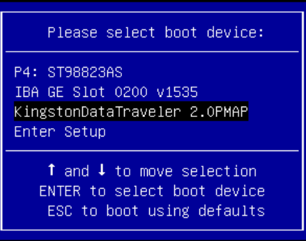  

7. Una vez que estemos en el menu de booteo seleccionaremos la USB donde tenemos el sistema operativo y la iniciaremos.

8. Si realizamos todos los pasos de manera correcta se iniciara la instalacion de ubuntu donde tendremos esto como primera pantalla.
  

  

9. En esta pantalla seleccionaremos la opcion de instalar ubuntu al igual que el lenguaje preferido.

10. Seguido de esto nos pedira la preferencia del teclado, seleccionaremos la que mas nos agrade.
  

  

11. Seguido de esto tendremos que elegir entre el tipo de instalacion (es recomendado utilizar la instalacion normal debido a que es mas completa) al igual que nos brindara otras opciones como descargar actualizaciones al instalar ubuntu y programas de terceros(estas opciones son recomendables en caso de haber establecido una conexion a internet en la mayoria de los casos).
  

   

12. Seguido de esto nos brindara la opcion de instalar ubuntu junto a windows en caso de instalar dentro de la misma computadora, aqui seleccionaremos esa opcion y daremos aceptar.
  

   

13. Seguido de esto nos abrira un menu en el cual podemos darle los recursos que nosotros queramos a cada uno de los sistemas, se recomienda dejar una amplia cantidad de recursos para ambos sistemas para su mejor rendimiento.
  

   

14. Seguido de esto seleccionaremos nuestra localizacion para fijar la hora del sistema.
  

   

15. Una vez realizado la seleccion procederemos a la creacion de usuarios donde llenaremos los datos bajo nuestro criterio (la opcion de nombre de equipo se rellena automaticamente pero puede ser editado en caso de asi desearlo).
  

   

16. Una vez realizado esto habremos terminado con nuestra instalacion. 

17. Pasos extras: una vez establecida una conexion a internet abriremos una terminal donde tiraremos los comandos sudo apt update y sudo apt upgrade para actualizar todo en caso de que no se realizara en la instalacion.